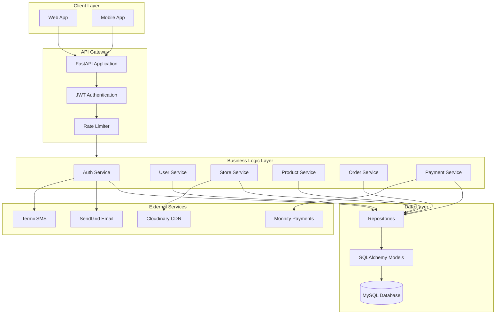

# AGM Store Builder Backend

A high-performance Python FastAPI backend for the **AGM Store Builder** e-commerce platform. This API powers store creation, product management, order processing, and Monnify payment integration for Nigerian merchants.

[](https://python.org)
[](https://fastapi.tiangolo.com)
[](https://mysql.com)
[](LICENSE)

---

## Overview

AGM Store Builder enables entrepreneurs to create and manage their online stores with ease. This backend provides:

- **Store Management** - Create, customize, and manage multiple stores
- **Product Catalog** - Full product lifecycle with variants, inventory, and media
- **Order Processing** - End-to-end order management with status tracking
- **Payment Integration** - Monnify gateway for Nigerian bank transfers and card payments
- **User Authentication** - JWT-based auth with email/phone verification
- **Analytics** - Store performance metrics and insights

---

## Architecture



---

## Tech Stack

| Category | Technologies |
|----------|-------------|
| **Framework** | FastAPI, Uvicorn, Pydantic v2 |
| **Database** | MySQL 8.0, SQLAlchemy 2.0, aiomysql |
| **Authentication** | python-jose (JWT), passlib (bcrypt) |
| **Payments** | Monnify API |
| **File Storage** | Cloudinary |
| **Communications** | SendGrid (Email), Termii (SMS) |
| **Dev Tools** | pytest, black, ruff, mypy |

---

## Project Structure

```
agm-store-backend/
├── app/
│   ├── api/                  # API routes (versioned)
│   │   └── v1/               # Version 1 endpoints
│   ├── core/                 # Configuration, security, exceptions
│   ├── database/             # Connection, sessions, base models
│   ├── middleware/           # CORS, rate limiting, error handling
│   ├── models/               # SQLAlchemy ORM models
│   ├── repositories/         # Data access layer
│   ├── schemas/              # Pydantic request/response schemas
│   ├── services/             # Business logic layer
│   ├── templates/            # Email/SMS templates
│   ├── utils/                # Helpers and utilities
│   └── main.py               # Application entry point
├── scripts/                  # Utility scripts
├── pyproject.toml            # Project configuration
└── README.md
```

---

## Getting Started

### Prerequisites

- Python 3.12+
- MySQL 8.0+
- [uv](https://github.com/astral-sh/uv) (recommended) or pip

### Installation

1. **Clone the repository**
   ```bash
   git clone https://github.com/thetruesammyjay/agm-store-backend.git
   cd agm-store-backend
   ```

2. **Create virtual environment and install dependencies**
   ```bash
   # Using uv (recommended)
   uv sync

   # Or using pip
   python -m venv .venv
   source .venv/bin/activate  # Windows: .venv\Scripts\activate
   pip install -e .
   ```

3. **Configure environment variables**
   ```bash
   cp .env.example .env
   # Edit .env with your configuration
   ```

4. **Set up the database**
   ```bash
   # Create MySQL database
   mysql -u root -p -e "CREATE DATABASE agm_store_builder CHARACTER SET utf8mb4 COLLATE utf8mb4_unicode_ci;"
   ```

5. **Run the development server**
   ```bash
   uvicorn app.main:app --reload --host 0.0.0.0 --port 8000
   ```

---

## Environment Variables

| Variable | Description |
|----------|-------------|
| `DB_HOST` | MySQL host address |
| `DB_PORT` | MySQL port (default: 3306) |
| `DB_USER` | Database username |
| `DB_PASSWORD` | Database password |
| `DB_NAME` | Database name |
| `JWT_SECRET_KEY` | Secret key for JWT tokens |
| `MONNIFY_API_KEY` | Monnify API key |
| `MONNIFY_SECRET_KEY` | Monnify secret key |
| `MONNIFY_CONTRACT_CODE` | Monnify contract code |
| `CLOUDINARY_CLOUD_NAME` | Cloudinary cloud name |
| `CLOUDINARY_API_KEY` | Cloudinary API key |
| `SENDGRID_API_KEY` | SendGrid API key |
| `TERMII_API_KEY` | Termii API key |

---

## API Documentation

Once the server is running, access the interactive API documentation:

- **Swagger UI**: [http://localhost:8000/docs](http://localhost:8000/docs)
- **ReDoc**: [http://localhost:8000/redoc](http://localhost:8000/redoc)

### Key Endpoints

| Method | Endpoint | Description |
|--------|----------|-------------|
| `POST` | `/api/v1/auth/register` | Register new user |
| `POST` | `/api/v1/auth/login` | User login |
| `GET` | `/api/v1/stores` | List stores |
| `POST` | `/api/v1/stores` | Create store |
| `GET` | `/api/v1/products` | List products |
| `POST` | `/api/v1/orders` | Create order |
| `POST` | `/api/v1/payments/initiate` | Initiate payment |
| `GET` | `/api/v1/analytics/dashboard` | Dashboard analytics |

---

## Database Schema

The application uses 10 core tables:

| Table | Description |
|-------|-------------|
| `users` | User accounts and profiles |
| `user_settings` | User preferences and notifications |
| `stores` | Store configurations |
| `products` | Product catalog |
| `orders` | Order records |
| `order_items` | Individual order line items |
| `payments` | Payment transactions |
| `bank_accounts` | User payout accounts |
| `otp_verifications` | OTP codes for verification |
| `refresh_tokens` | JWT refresh token storage |

---

## Development

### Running Tests

```bash
# Run all tests
pytest

# Run with coverage
pytest --cov=app --cov-report=html
```

### Code Formatting

```bash
# Format code
black .

# Lint code
ruff check .

# Type checking
mypy app/
```

---

## Deployment

### HuggingFace Spaces

This backend is designed for deployment on HuggingFace Spaces with Docker:

```dockerfile
FROM python:3.12-slim

WORKDIR /app
COPY requirements.txt .
RUN pip install --no-cache-dir -r requirements.txt
COPY . .

EXPOSE 7860
CMD ["uvicorn", "app.main:app", "--host", "0.0.0.0", "--port", "7860"]
```

---

## Contributing

1. Fork the repository
2. Create a feature branch (`git checkout -b feature/amazing-feature`)
3. Commit your changes (`git commit -m 'Add amazing feature'`)
4. Push to the branch (`git push origin feature/amazing-feature`)
5. Open a Pull Request

---

## License

This project is licensed under the MIT License - see the [LICENSE](LICENSE) file for details.

---

## Author

**Sammy Jay** - [@thetruesammyjay](https://github.com/thetruesammyjay)
